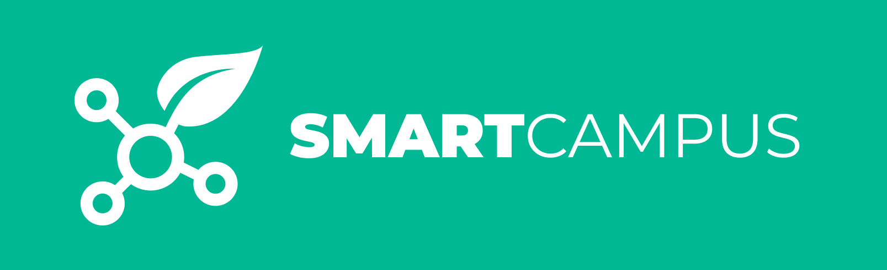

# SmartCampus | K13

<div align="center">
  
</div>

# Bienvenue sur le Projet Smart Campus - K13

Ce projet vise à développer une application Web pour le Smart Campus de l'IUT de La Rochelle, afin de collecter des données environnementales telles que le taux d'humidité, le taux de CO2 et la température des salles. L'application fournira des recommandations pour optimiser l'environnement en fonction de ces mesures.

## Documentation

Pour des informations détaillées sur le projet, veuillez consulter notre [Wiki](https://forge.iut-larochelle.fr/2023-2024-but-info2-a-sae34/k1/k13/smartcampus/-/wikis/home).

## 1. Stratégie de gestion des Branches et des commits

Le développement du projet est organisé en utilisant les branches Git. Voici la structure que nous utilisons :

```plaintext
main
└── dev
      └── v(numVersion)/(nameFeatures)
```

* `main` : Version stable et finale de l'application.
* `dev` : Environnement de développement pour la version en cours.
* `v<numVersion>/<nameFeature>` : Branche pour le développement de nouvelles fonctionnalités.


#### Cas d'utilisation
* **Développement et Intégration d'une Fonctionnalité :** <br>
Ce cas d'utilisation permet à chaque développeur de travailler sur sa propre fonctionnalité, de la sauvegarder régulièrement dans sa branche respective, puis de l'intégrer dans la branche release-1.0. Cela assure un développement itératif et une intégration progressive des fonctionnalités.

* **Récupération des Fonctionnalités Mises à Jour depuis la Branche dev :** <br>
Ce cas d'utilisation permet à chaque développeur de récupérer les fonctionnalités mises à jour depuis la branche dev sur sa branche de développement. Cela assure que chacun travaille sur une version à jour de l'application et réduit les conflits lors des fusions.

## 2. Format des Messages de Commit

Il est important que les messages de commit soient explicites et que des conventions soient respectées par l'équipe : **`<type>(<portée>): <sujet>`**

Pour plus de détails sur nos stratégies au sein du projet, consultez la [page dédiée de notre guide au sein de notre projet](https://forge.iut-larochelle.fr/2023-2024-but-info2-a-sae34/k1/k13/smartcampus/-/wikis/Guide%20d'utilisation%20de%20Git) sur notre [Wiki](https://forge.iut-larochelle.fr/2023-2024-but-info2-a-sae34/k1/k13/smartcampus/-/wikis/home). 

